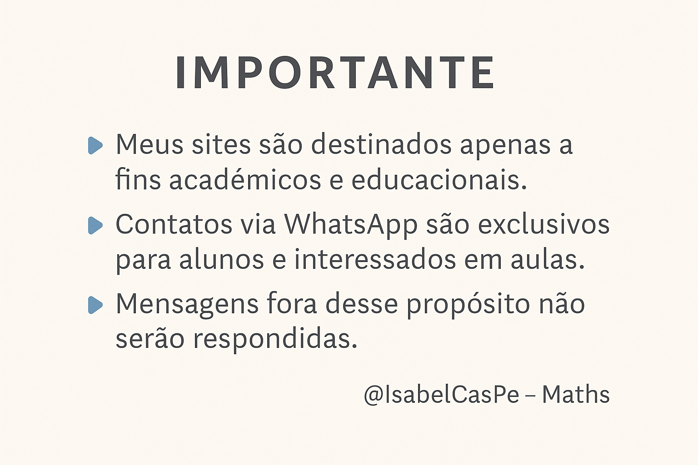
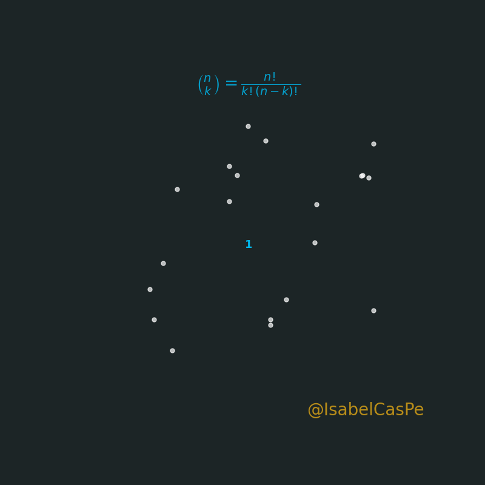
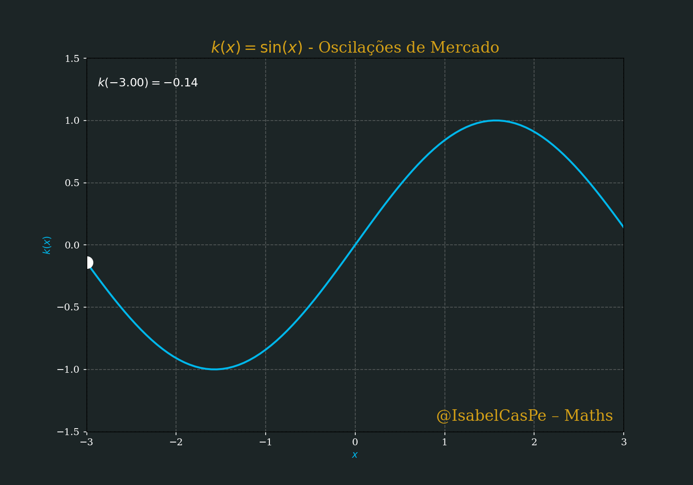
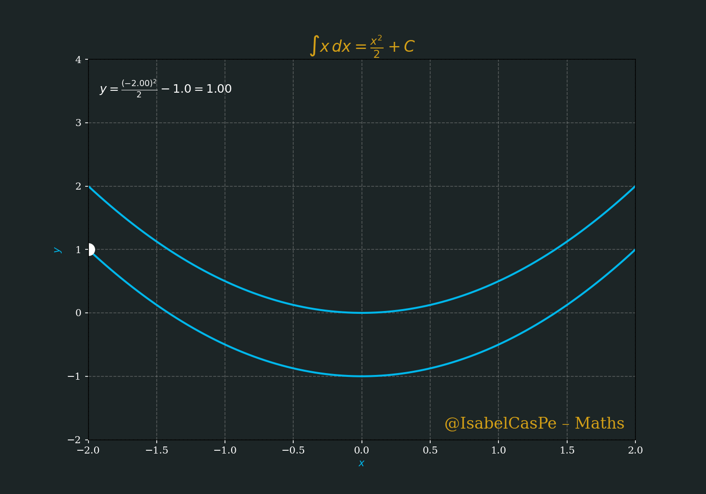
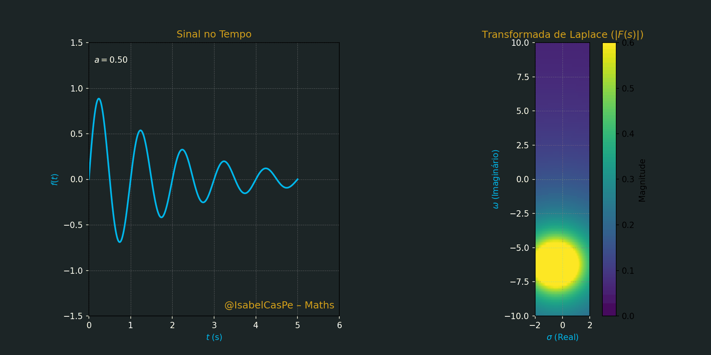
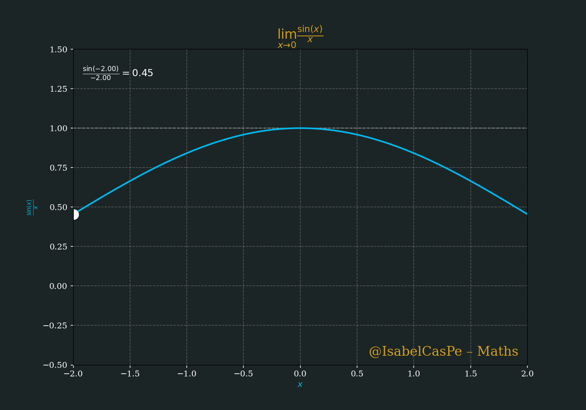
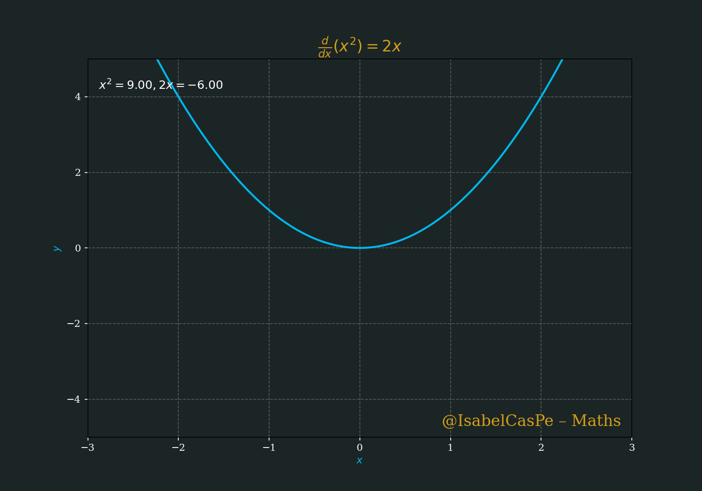
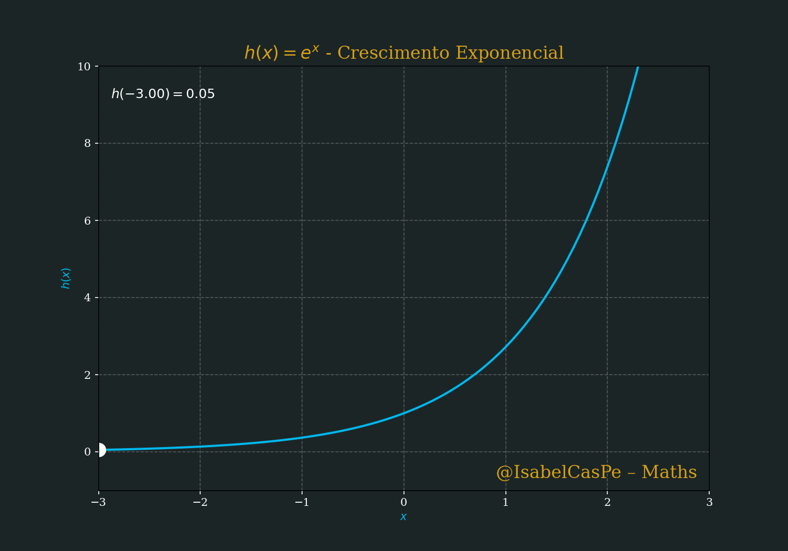
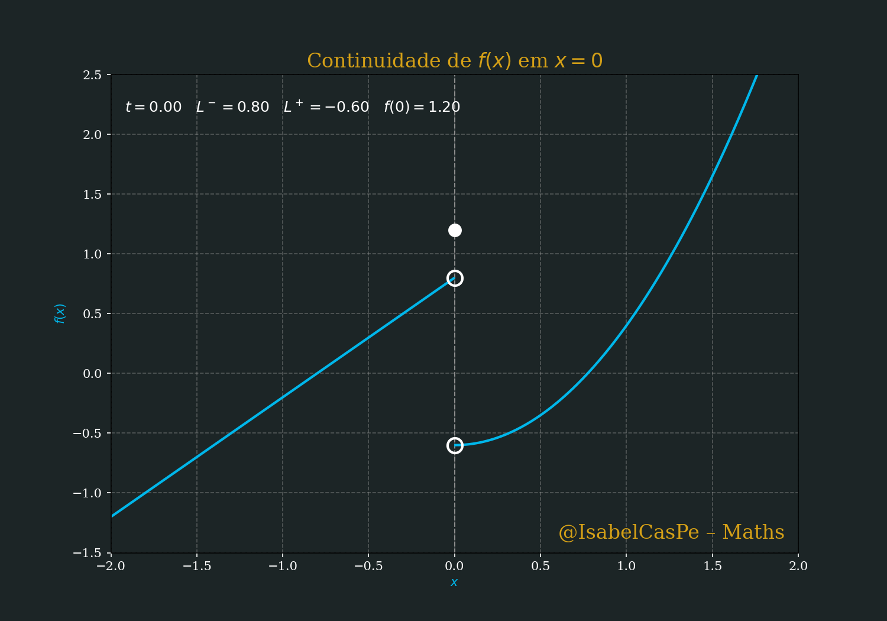
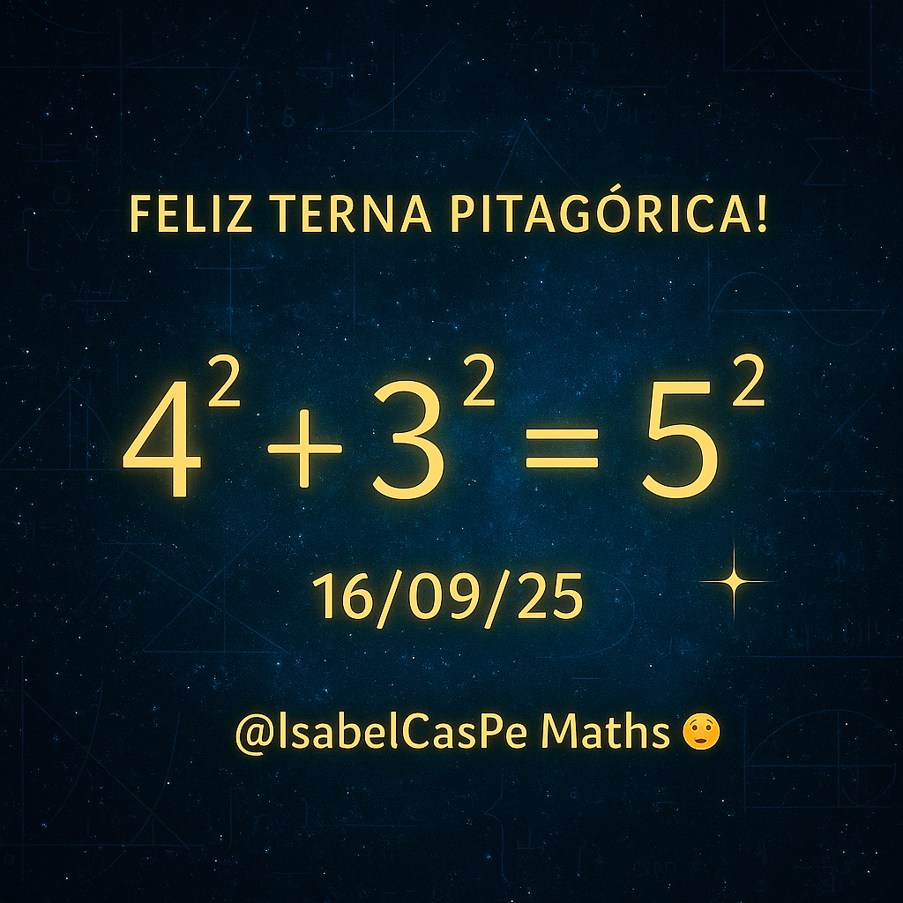

<!-- HERO -->
# Arte & Ciência em Movimento — Matemática Viva 💎🧮✨

  
 


[](https://teses.usp.br/teses/disponiveis/3/3151/tde-20102010-122044/en.php)
[](https://arxiv.org/abs/2504.01969)

**PT · EN · ES** · [Galeria](#galeria--gifs) · [Instalação](#instalação--installation--instalación) · [Licença MIT](#licença--license--licencia)

---
## SuperProf_Alunos: Materiais Didáticos de Matemática, Física e Aplicações

🌟 **Bem-vindo ao SuperProf_Alunos** 🌟  
Criado pela **Prof. Ana Isabel Castillo**, este repositório é um acervo de **materiais didáticos** desenvolvidos para alunos da plataforma SuperProf, abrangendo **Matemática**, **Física** e suas aplicações em **Finanças** e **Engenharia**. Com notebooks Jupyter e resoluções em PDF, o objetivo é oferecer exercícios práticos, revisões temáticas e desafios que estimulem o raciocínio lógico, a autonomia e a excelência acadêmica. 

## 🎯 Sobre o Repositório
O **SuperProf_Alunos** reúne recursos pedagógicos para estudantes de diversos níveis, desde fundamentos de Cálculo e Física até tópicos avançados como Equações Diferenciais, Séries de Fourier e Sistemas Dinâmicos. Os materiais são organizados para:
- **Reforçar conceitos:** Exercícios resolvidos e explicações passo a passo.
- **Aplicar na prática:** Problemas com relevância em Finanças (ex.: modelagem populacional) e Engenharia (ex.: controle linear).
- **Desafiar os alunos:** Conjecturas matemáticas e simulações computacionais.

Os arquivos estão divididos em **notebooks Jupyter** ([notebooks/](notebooks/)) e **resoluções em PDF** ([pdfs/](pdfs/)), todos licenciados sob [CC BY-NC-ND 4.0](https://creativecommons.org/licenses/by-nc-nd/4.0/) para uso educacional exclusivo.

- 

## 📚 Conteúdo
Os materiais estão organizados por área temática:
## 🎞️ Galeria de GIFs
---
## ✨ Triângulo de Pascal Animado

O Triângulo de Pascal é uma das construções matemáticas mais fascinantes, revelando padrões infinitos a partir de uma estrutura simples.  
Nesta animação, cada linha nasce pela soma de vizinhos, mostrando como a matemática combina **beleza, ordem e criatividade**.  

🎥 Veja a animação:  


🔗 Arquivo: [`pascal_triangle.py`](superprof/pascal_triangle/pascal_triangle.py) Só para Vips 


  
*Função Quadrática*

  
*Saddle Surface Dynamic*

 
*Oscilação Senoidal*

 
*Hyperbolic Dynamics*

 
*Integral Indefinida* 

  
*Laplace (animação)*

 
*Limite de função*

 
*Derivada de uma função*

 
*Crescimento Exponencial*

 
*Integral Definida*

  
*Continuidade de funções*

 

---

### Matemática
- **Cálculo I e III**
  - [CalculoIaula1.ipynb](CalculoIaula1.ipynb): Introdução a limites, derivadas e integrais.
  - [vetoresCalculo1.ipynb](vetoresCalculo1.ipynb): Operações com vetores no espaço.
  - [Trabalho01.ipynb](Trabalho01.ipynb): Cálculo de trabalho usando integrais.
  - [Hamilton_Luiz_Guidorizzi_Resolucoes_3.pdf](Hamilton_Luiz_Guidorizzi_Resolucoes_3.pdf): Resoluções de *Um Curso de Cálculo 3*.
- **Álgebra Linear**
  - [Gauss.ipynb](Gauss.ipynb): Eliminação Gaussiana para sistemas lineares.
- **Equações Diferenciais**
  - [EqEULER.ipynb](EqEULER.ipynb): Solução de equações de Euler.
  - [crescimento_de_uma_população1.ipynb](crescimento_de_uma_população1.ipynb): EDOs simples aplicadas a crescimento populacional.
  - [Lotka_Volterra.ipynb](Lotka_Volterra.ipynb): Modelo predador-presa.
- **Análise Numérica**
  - [Funções.ipynb](Funções.ipynb): Manipulação de funções matemáticas.
  - [Manipulação_de_variáveis_e_constantes.ipynb](Manipulação_de_variáveis_e_constantes.ipynb): Operações com variáveis.
  - [Operações_Matemáticas.ipynb](Operações_Matemáticas.ipynb): Operações básicas.
- **Séries de Fourier**
  - [Ondaquadrada.ipynb](Ondaquadrada.ipynb): Representação de funções periódicas.
  - [Q1Q2_TFourier.pdf](Q1Q2_TFourier.pdf): Resolução de exercícios Q1 e Q2.
- **Conjecturas**
  - [ABCconjetura.ipynb](ABCconjetura.ipynb): Introdução à Conjectura ABC.
  - [goldbach.ipynb](goldbach.ipynb): Exploração da Conjectura de Goldbach.
- **Probabilidade e Combinatória**
  - [Diagramadelarbol.ipynb](Diagramadelarbol.ipynb): Diagramas de árvore para probabilidade.
- **Lógica**
  - [Operadores_lógicos_e_relacionais.ipynb](Operadores_lógicos_e_relacionais.ipynb): Fundamentos de lógica matemática.

### Física
- **Mecânica**
  - [4GraMRU.ipynb](4GraMRU.ipynb): Movimento Retilíneo Uniforme.
  - [MovimentoHarmonico.ipynb](MovimentoHarmonico.ipynb): Movimento Harmônico Amortecido.
  - [oscilador_harmônico_amortecido.ipynb](oscilador_harmônico_amortecido.ipynb): Simulações de osciladores. 
- **Ondas e Física Moderna**
  - [EqOnda.ipynb](EqOnda.ipynb): Equação da onda e suas soluções.
  - [EqSchrodinger.ipynb](EqSchrodinger.ipynb): Equação de Schrödinger aplicada.

### Aplicações Práticas
- **Controle Linear**
  - [ControleLinearDB.ipynb](ControleLinearDB.ipynb): Fundamentos de controle com aplicações.
- **Programação Linear**
  - [OLinear (1).ipynb](notebooks/OLinear (1).ipynb): Resolução de problemas de otimização.
- **Geometria Computacional**
  - [polygono1.ipynb](polygono1.ipynb): Manipulação de polígonos.

📢 **Nota Legal:** Os materiais são compartilhados para fins educacionais sob licença [License MIT](https://creativecommons.org/licenses/MIT). Para outros usos, contate a autora (anacp20@gmail.com).

## 🚀 Como Usar
- **Notebooks Jupyter:**
  - Baixe os arquivos `.ipynb` da pasta [notebooks/](notebooks/) e abra no **Jupyter Notebook** ou **Google Colab**.
  - Requisitos: Instale as bibliotecas Python:
    ```bash
    pip install numpy matplotlib scipy pandas
    ```
- **Resoluções em PDF:**
  - Acesse os arquivos em [pdfs/](pdfs/) para estudar offline ou consultar exercícios resolvidos.
- **Dicas de Estudo:**
  - Comece pelos tópicos de fundamentos (ex.: [Operações_Matemáticas.ipynb](Operações_Matemáticas.ipynb)) e avance para aplicações (ex.: [Lotka_Volterra.ipynb](Lotka_Volterra.ipynb)).
  - Use os notebooks interativamente, ajustando parâmetros e testando exemplos.
- **Acesse Online:** Em breve, visite (https://IsabelCasPe/SuperProf_Alunos/) 
- **Feedback:** Envie dúvidas ou sugestões via [Issues](https://github.com/IsabelCasPe/SuperProf_Alunos/issues).

##  Planos Futuros
- Adicionar novos notebooks com tópicos avançados (ex.: Monte Carlo, otimização financeira).
- Criar vídeos explicativos para os exercícios mais desafiadores.
- Organizar desafios mensais para alunos da SuperProf.
- Desenvolver um índice interativo com busca por tópicos.

## Agradecimento
Este repositório é dedicado aos meus alunos da SuperProf, cuja curiosidade e dedicação inspiram meu trabalho. Agradeço à comunidade acadêmica por apoiar a disseminação do conhecimento e à plataforma SuperProf por conectar mentes brilhantes.

## 📬 Contato
- **Autora:** Prof. Ana Isabel Castillo  
- **Email:** [anacp20@gmail.com](mailto:anacp20@gmail.com)  
- **GitHub:** [@IsabelCasPe](https://github.com/IsabelCasPe)  
- **Site:** [isabelcaspe.github.io](https://isabelcaspe.github.io/)  
- **Repositório:** [github.com/IsabelCasPe/SuperProf_Alunos](https://github.com/IsabelCasPe/SuperProf_Alunos)

🌟 **Gostou? Deixe uma estrela no repositório e continue aprendendo com paixão!** 🌟

- [Website SuperProf Isabel](https://www.superprof.com.br/doutoranda-matematica-aplicada-ime-usp-mestre-ciencias-pela-pme-escola-politecnica-usp-ofereco-reforco-universitario.html)
----
## License
Creative Commons Attribution-NonCommercial-NoDerivatives 4.0 International LIcense MIT
Copyright © Ana Isabel C. - 2025

---
## Inspiration.
> "Com gratidão aos meus alunos, abro as portas do conhecimento @SuperProf_Alunos como professora, compartilho a clareza do cálculo e a beleza da matemática." 👩‍🏫📘📖✨🎓
> Copyright © 2025 Prof. Ana Isabel C. 💙

---


 
